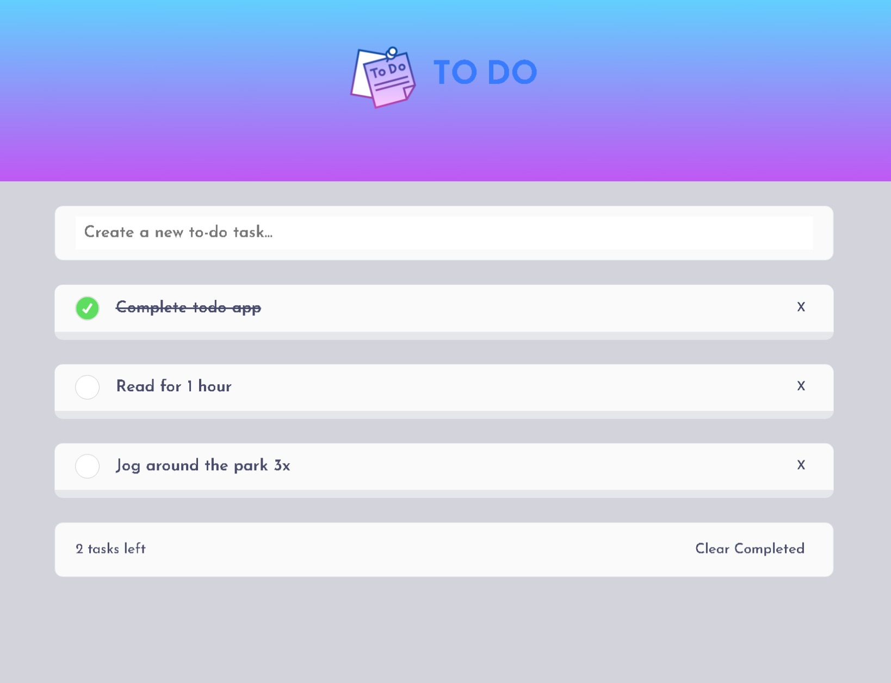

# Aplicación-de-tareas-pendientes

Aplicación para añadir y gestionar tareas pendientes con almacenamiento local. Para crearla no he utilizado ningún framework de JavaScript; solamente HTML, CSS y JavaScript puro.

## Tabla de contenidos

- [Resumen](#resumen)
  - [Aplicaión](#la-aplicacion)
  - [Screenshot](#screenshot)
  - [Links](#links)
- [Mi proceso](#mi-proceso)
  - [Paso a paso](#paso-a-paso)
  - [¿Qué he aprendido?](#que-he-aprendido)
  - [Algunos detalles](#algunos-detalles)
  - [Recursos útiles](#recursos-utiles)
- [Autor](#autor)
- [Reconocimientos](#reconocimientos)

## Resumen

### Aplicación

Los usuarios pueden añadir nuevas tareas en el 'input' de entrada presionando la tecla 'Enter':

- Una vez añadida la tarea, puede eliminarse presionando el botón 'X' o marcarse como
hecha.

- Las tareas permanecerán almacenadas en el almacenamiento local del navegador que se este utilizando.

### Screenshot

### Links

- Live Site URL: (https://to-do-live-site.netlify.app/)

## Mi proceso

### Paso a paso:

- Estructura HTML5
- Personalizar las varibales en CSS
- Flexbox
- Crear un objeto para cada tarea cuando se ejecuta el evento 'submit'
- Definir una función para mostrar todas la tareas en la aplicación de manera dinámica
- Delegación de eventos desde el DOM con 'matches()' y 'dataset'

### Que he aprendido

En este proyecto he aprendido a almacenar y trabajar con datos guardados en el almacenamiento local utilizando la propiedad 'localStorage' de la interfaz 'Window'. Como las claves y valores de esta propiedad son siempre cadenas de texto, he utilizado 'JSON.stringify()' para convertir un objeto a cadena de texto 'JSON' y así poder agregar cada objeto con su tarea e identificador al objeto local 'Storage'. Y 'JSON.parse()' para analizar una cadena de texto como JSON y de esta manera poder leer los objetos almacenados.

Para poder entender toda la lógica del código de JavaScript, es necesario mirar el siguiente 'snippet' creado del elemento HTML:

"Template in HTML": {
    "prefix": "template",
    "body": ["<template>$1</template>"],
    "description": "Agrega el template en html"
}

### Algunos detalles

Para mantener las tareas mostradas en nuestra aplicación entre las distintas sesiones de navegación utilizaremos el evento 'DOMContentLoaded', el cual se ejecuta cuando el documento HTML ha sido completamente analizado y todos los 'scripts' se han descargado y procesado. 

Como en el almacenamiento local permanecerán nuestros datos añadidos, en caso de haberlos los mostraremos con la función previamente creada 'showTodo()'.

### Recursos utiles

- [localStorage recurso 1](https://developer.mozilla.org/es/docs/Web/API/Window/localStorage) - Documentación de modzilla para entender más acerca de la propiedad de window, 'localstorage'.
- [JSON.stringify() recurso 2](https://developer.mozilla.org/es/docs/Web/JavaScript/Reference/Global_Objects/JSON/stringify) - Documentación de modzilla sobre el método 'JSON.stringify()' y cómo implementarlo.

## Autor

- Website - [Lucas Todarello](https://lucas-todarello-portfolio.netlify.app/)
